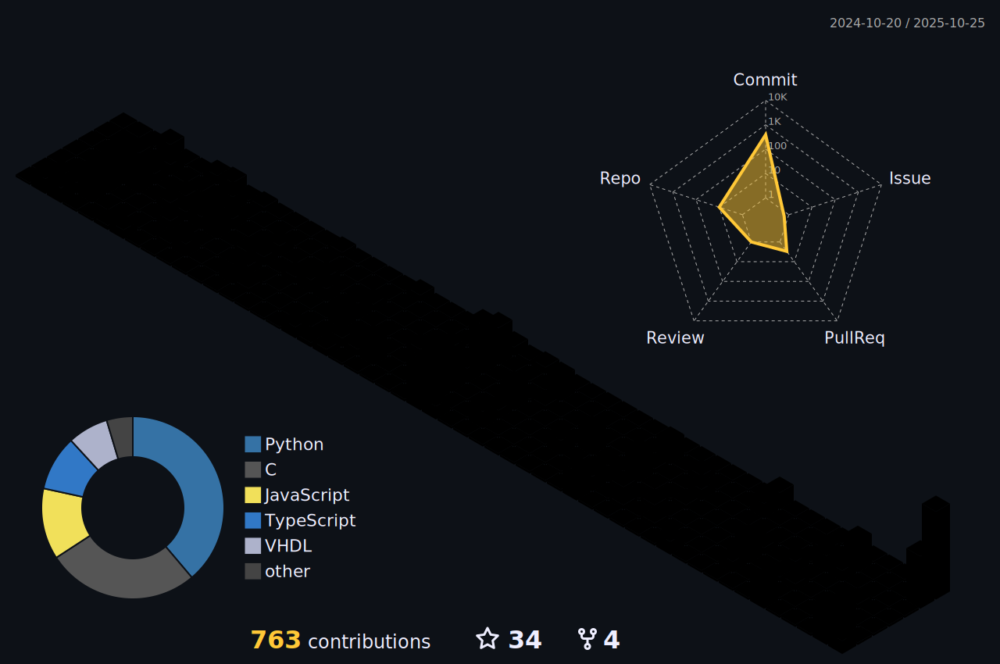

<div align="center"></div>
<h6 align="center">If you send a friend request, please let me know your Discord username. I think I have too many scam friend requests :/</h6>
<br>
<div align="center">
  <a href="https://discords.com/bio/p/atomic09" target="_blank" rel="noreferrer" ></a>
  <a href="https://wakatime.com/@018d9e20-7204-40cc-9d2f-4231bc99a8de" target="_blank" rel="noreferrer"></a>
  <a href="https://github.com/ATOMIC09#other"></a>
  <a href="https://www.youtube.com/channel/UC3FvuPtV_Ry46j5m-I2zcjg" target="_blank" rel="noreferrer"></a>
</div>

###
👋 Hi! My name is **Atom** (aka. Atomic)<br><br>
🌱 I'm currently interested in **Networking**<br><br>
💻 Sometimes I work on a [**public project**](https://github.com/ATOMIC09?tab=repositories)<br><br>
🎙️ I'm a voice narrator and video editor of [**der**](https://www.youtube.com/channel/UC3FvuPtV_Ry46j5m-I2zcjg)<br><br>
😪 And I'm also a lazy [**video editor**](https://www.youtube.com/channel/UCr7JiLK-AVQoXAOEWHpHhlg)<br><br>
🤣 Fun fact [**Meme maker?**](https://youtu.be/QqjGi20qmVQ)<br><br>
🖼️ Profile credit is [**here**](https://www.pixiv.net/en/artworks/131699262)

<details open>
<summary><h1 align="center">📈 Stack & Statistics</h1></summary>
<div align="center">

| Front-end | Back-end | General Purpose |
| --------- | -------- | ---------------- |
|         |   |  |

| Cloud / Hosting | Tools | Embedded |
| --------------- | ----- | -------- |
|       |       |  |

| Home Automation | Storage / Network | Operating Systems | Game Engines |
| --------------- | ----------------- | ----------------- | ----------- |
|    |   |      |   |


</div>
<br>

<div align="center">
  
  
  
  
</div>

<div align="center">
  <h1 align="center">🏆 Trophies<h1/>
  
</div>
</details>

<details>
<summary><h1 align="center">Other</h1></summary>
<div align="center">
  <a href="https://youtu.be/thybJjixXw0">
    
  </a>
  <br/>
  <br/>
  <p>ผู้ใช้ iPad Pro ปี 2020 "หลังหัก"</p>
</div>
</details>

<br>
<div align="center">
  <div>
    <h1 align="center">
      
      WakaTime Statistics
    </h1>
  </div>
  <div align="center">
  <!--START_SECTION:waka-->

```rust
From: 11 February 2024 - To: 08 January 2026

Total Time: 540 hrs 53 mins

TypeScript        150 hrs 57 mins ⣿⣿⣿⣿⣿⣿⣿⣀⣀⣀⣀⣀⣀⣀⣀⣀⣀⣀⣀⣀⣀⣀⣀⣀⣀   27.91 %
Python            123 hrs 3 mins  ⣿⣿⣿⣿⣿⣶⣀⣀⣀⣀⣀⣀⣀⣀⣀⣀⣀⣀⣀⣀⣀⣀⣀⣀⣀   22.75 %
JavaScript        62 hrs 18 mins  ⣿⣿⣷⣀⣀⣀⣀⣀⣀⣀⣀⣀⣀⣀⣀⣀⣀⣀⣀⣀⣀⣀⣀⣀⣀   11.52 %
C                 49 hrs 40 mins  ⣿⣿⣤⣀⣀⣀⣀⣀⣀⣀⣀⣀⣀⣀⣀⣀⣀⣀⣀⣀⣀⣀⣀⣀⣀   09.18 %
VHDL              29 hrs 47 mins  ⣿⣤⣀⣀⣀⣀⣀⣀⣀⣀⣀⣀⣀⣀⣀⣀⣀⣀⣀⣀⣀⣀⣀⣀⣀   05.51 %
C++               25 hrs 24 mins  ⣿⣄⣀⣀⣀⣀⣀⣀⣀⣀⣀⣀⣀⣀⣀⣀⣀⣀⣀⣀⣀⣀⣀⣀⣀   04.70 %
Bash              21 hrs 48 mins  ⣿⣀⣀⣀⣀⣀⣀⣀⣀⣀⣀⣀⣀⣀⣀⣀⣀⣀⣀⣀⣀⣀⣀⣀⣀   04.03 %
Markdown          16 hrs 53 mins  ⣷⣀⣀⣀⣀⣀⣀⣀⣀⣀⣀⣀⣀⣀⣀⣀⣀⣀⣀⣀⣀⣀⣀⣀⣀   03.12 %
JSON              8 hrs 18 mins   ⣤⣀⣀⣀⣀⣀⣀⣀⣀⣀⣀⣀⣀⣀⣀⣀⣀⣀⣀⣀⣀⣀⣀⣀⣀   01.54 %
Text              8 hrs 11 mins   ⣤⣀⣀⣀⣀⣀⣀⣀⣀⣀⣀⣀⣀⣀⣀⣀⣀⣀⣀⣀⣀⣀⣀⣀⣀   01.52 %
```

<!--END_SECTION:waka-->
  </div>
</div>
<br>
<div align="center">
    
    
    <br>
    
    <h6 align="center">ต้องมีสักอันที่ถูกแหละนะ</h6>
    
    <h6 align="center">ว่าแต่ใครทำอะไรจน 2 ล้านวิวฟระนั่น 🗿</h6>
</div>


